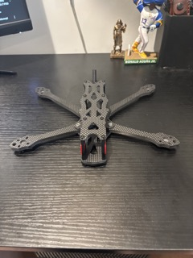
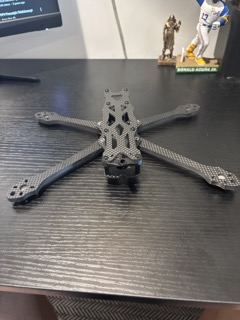
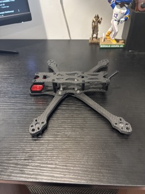
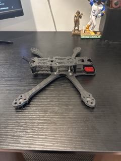

# 🧱 Frame Assembly

## 🛠️ Goal
Assemble the ImpulseRC ApexDC EVO 5" frame and mount all mechanical components securely to prepare for electronics integration.

## 🧩 Parts Used
- ImpulseRC ApexDC EVO 5" carbon fiber frame
- M3 screws and standoffs (included)

## 🔧 Steps

1. Unboxed and verified all frame pieces.
2. Assembled bottom plate, arms, and top plate using included hardware.
3. Ensured arms were tightly secured using crossbar lock system.

## 📝 Notes

1. Made sure to use M3 spacing according to SpeedyBee description, has not arrived yet in mail as of 6/18/25.
2. Used 20mm mounting bolts to go with the 16.5mm tall board from SpeedyBee

## 📸 Photos

